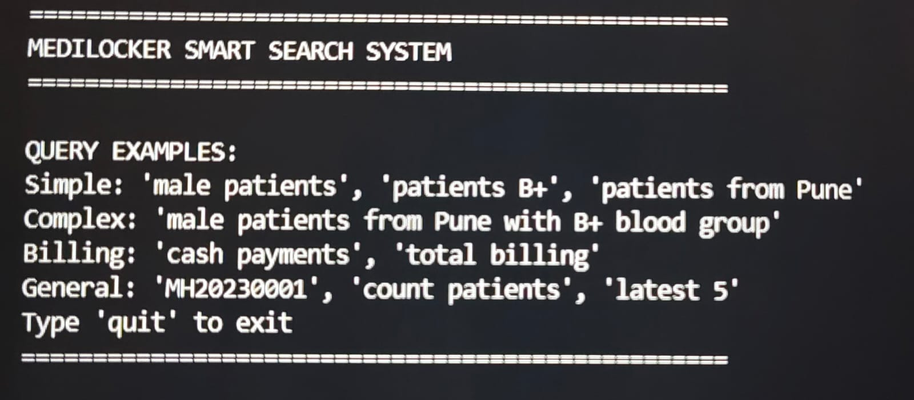
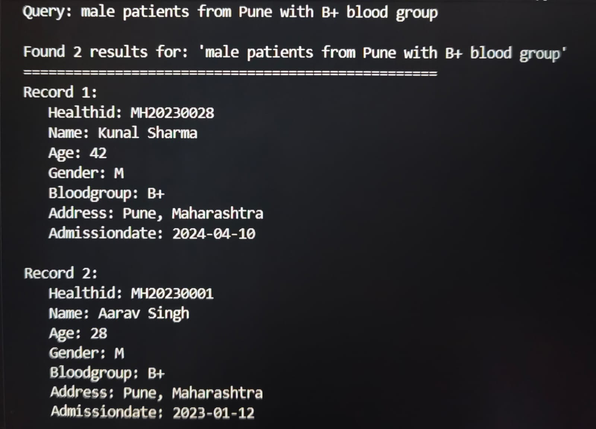
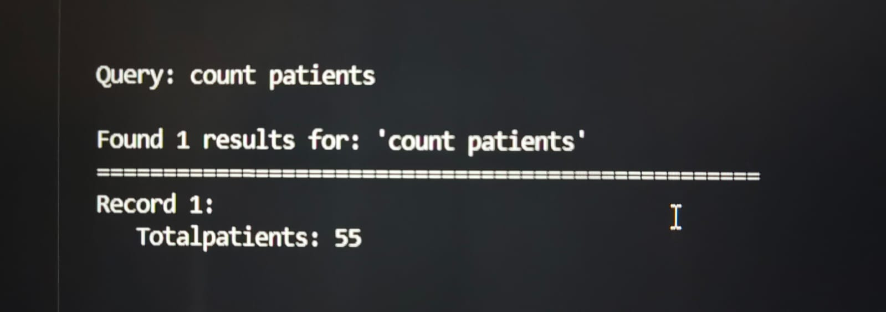
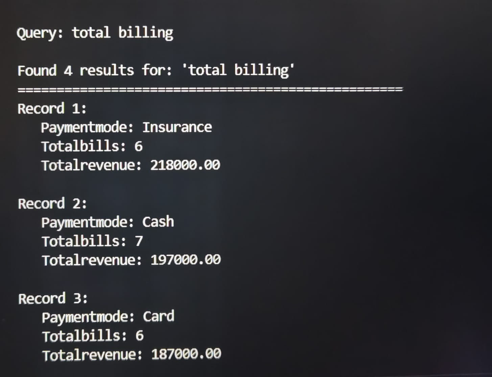

# MediLocker – Smart Digital Health Record System

## Overview

MediLocker is a healthcare record management system developed using Python and MySQL. The project enables efficient storage, retrieval, and management of patient records through a rule-based query processing system using regular expressions and keyword matching.

## Technologies Used

* Python
* MySQL
* Regular Expressions (Regex)
* DBMS

## Features

* Patient Record Management
* Smart Patient Search
* Billing Information Analysis
* Patient Count Statistics
* SQL Query Generation using Regex and Keyword Matching
* Efficient Database Retrieval

## Project Highlights

* Developed a healthcare record management system using Python and MySQL.
* Implemented a rule-based query processing system for handling user queries.
* Converted user inputs into SQL queries using regex patterns and keyword matching.
* Improved accessibility and retrieval of healthcare records.

## Project Screenshots

### Main Interface

### Patient Search Results

### Patient Count Output

### Billing Analytics Output

## Documentation

Project Report: `Medilocker_report.pdf`

## Future Scope

* Web-Based User Interface
* Voice-Based Query Processing
* Advanced Query Understanding
* Cloud Database Integration
* Role-Based Authentication

## Project Type

Academic DBMS and Python Project
